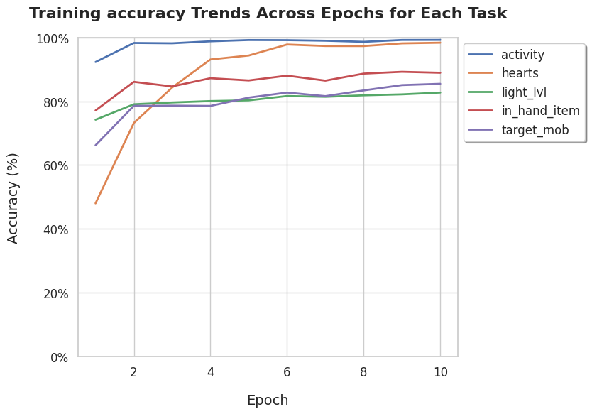
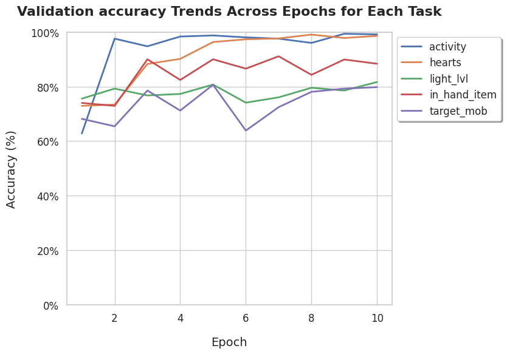
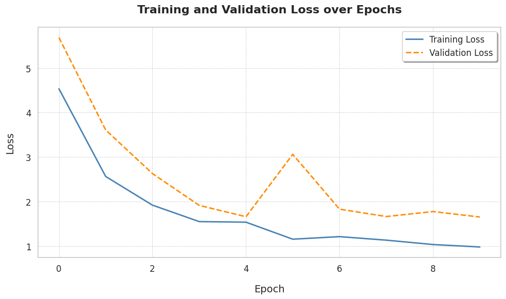

# MSPV: A Modular Simulation-to-Real Pipeline for Cost-Effective AI Hypothesis Validation

Welcome to **MSPV**, an open-source repository providing code of the implementation of the example from our scientific paper:

> **MSPV: A Modular Simulation-to-Real Pipeline for Cost-Effective AI Hypothesis Validation**  
> by *Artyom Tashyan, Saidjon Khaydar-Zade, Pavel Tin*

### Graph of model`s structure:


**Important Files and Directories**:

- **`data/`**: Scripts for data processing, labeling, and CSV-based metadata.
- **`interface/`**: Code for UI elements
- **`model/`**: Training notebooks for CNN-based feature extraction and the Random Forest decision-making model, along with pre-trained weights.
- **`static/`**: Static assets such as fonts or icons. (Also contains files of saved models.)
- **`main.py`**: Entry point to start the script

---

## Installation

If you plan to run it locally, follow this guide:

1. **Clone the Repository**:
    ```bash
    git clone https://github.com/sqdArtemy/mspv.git
    cd mspv
    ```

2. **Set Up a Virtual Environment (Recommended)**:

    ```bash
    python -m venv .venv
    ```
    Activate the environment:
    - **Unix/Linux/MacOS**:
        ```bash
        source .venv/bin/activate
        ```
    - **Windows**:
        ```bash
        .venv\Scripts\activate
        ```
3. **Install Dependencies**:
    ```bash
    pip install --upgrade pip
    pip install -r requirements.txt
    ```
    The `requirements.txt` includes packages like *PyTorch*, *scikit-learn*, *NumPy*, and more.

4. **(Optional) GPU Support**:
    - If you have a CUDA-enabled GPU, ensure you install the corresponding PyTorch version.
    - Alternatively, run on a cloud platform like Google Colab.

---

## Quick Start

1. **Download or Prepare Your Data**:
    - You can use Kaggle dataset created by ourselves: [Minecraft Screenshots Dataset with Features](https://www.kaggle.com/datasets/sqdartemy/minecraft-screenshots-dataset-with-features/data)
    - Place your raw/compressed images under `data/raw_images` or `data/compressed_images`.
    - Ensure your CSV files (e.g., `decisions.csv`, `sorted_decisions.csv`) align with your image filenames, if you use your own files.

2. **Inspect the Jupyter Notebooks**:
    - **`model/feature_extraction_model.ipynb`**: Example of training specialized CNN sub-models for different features.
    - **`model/decision_making_model.ipynb`**: Demonstrates how the extracted features feed into a `RandomForestClassifier` for multi-output decisions.

3. **Run the Pipeline**:
    - After previous steps are completed, you can finally run the application by: ``` python .\main.py ```
    - After interface starts, launch the minecraft on the **Full Screen** (This is important)
    - You can observe detected features and suggestions in the UI, based on the gameplay.

---

## Training Graphs

### Accuracies




### Losses


---

Contributions are welcome! Please open an issue or submit a pull request for any improvements or bug fixes.

## Contact

For questions or feedback, please contact [Artyom Tashyan](mailto:sqd.artemy@gmail.com).

